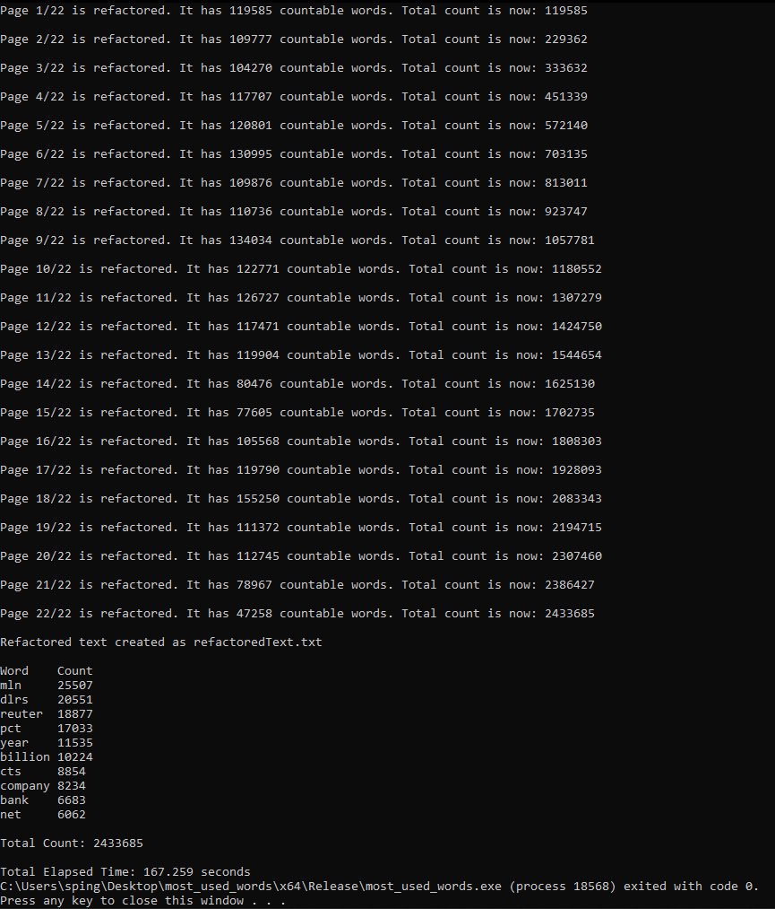

# most_used_words
 A C++ console application which reads files from Reuters-21578 documents collection appeared on the Reuters newswire in 1987 and find Top 10 frequent words used in the newswire articles. CMP2003 - Data Structures and Algorithms Term Project - January 22, 2021
 
[The Guideline](CMP2003TermProject.pdf)

